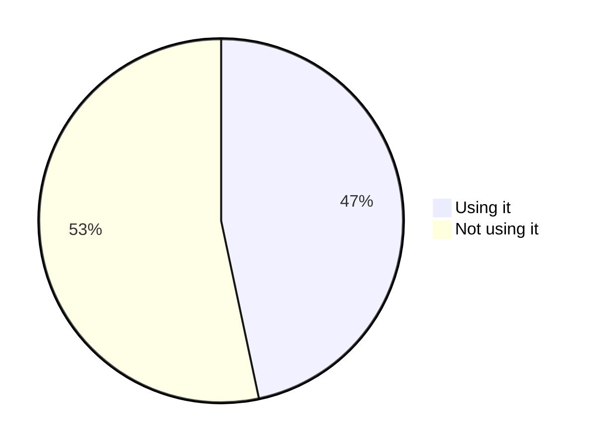
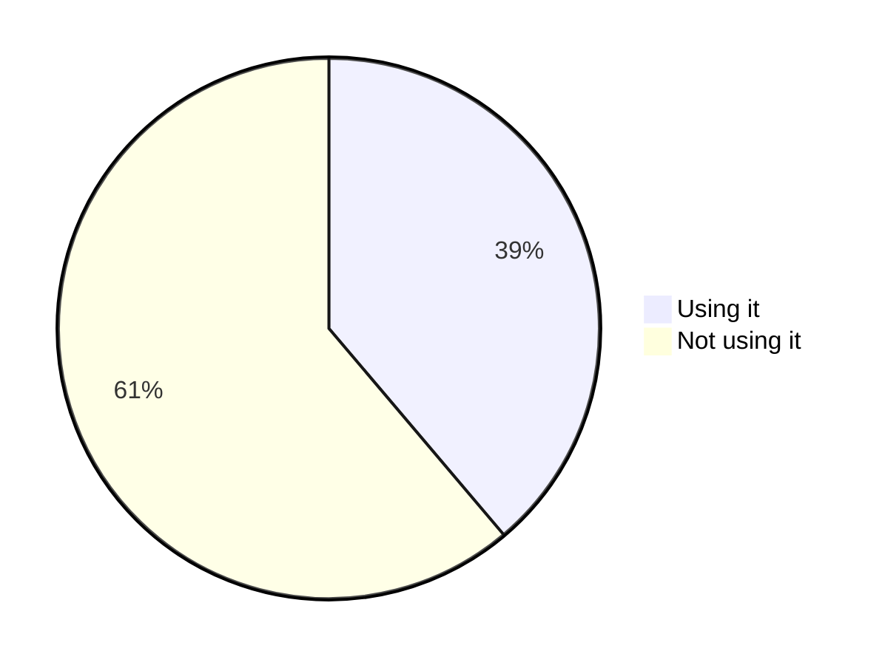
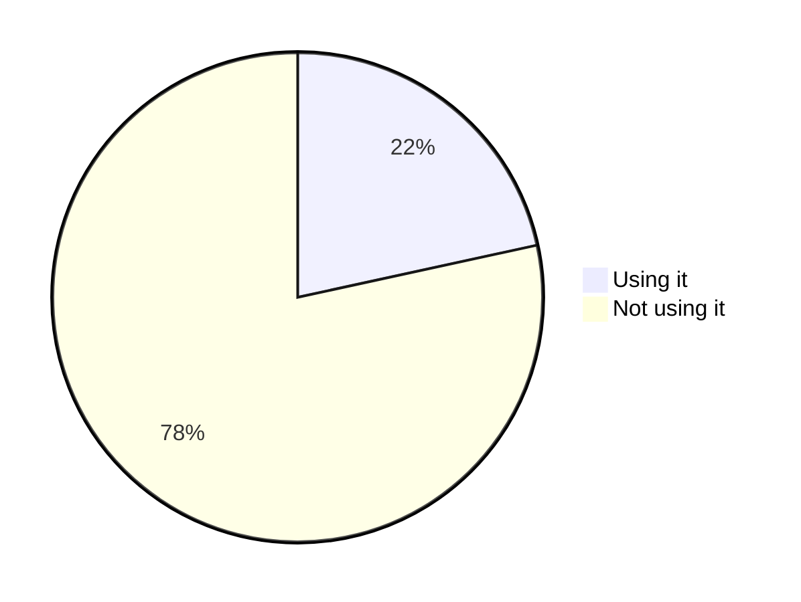
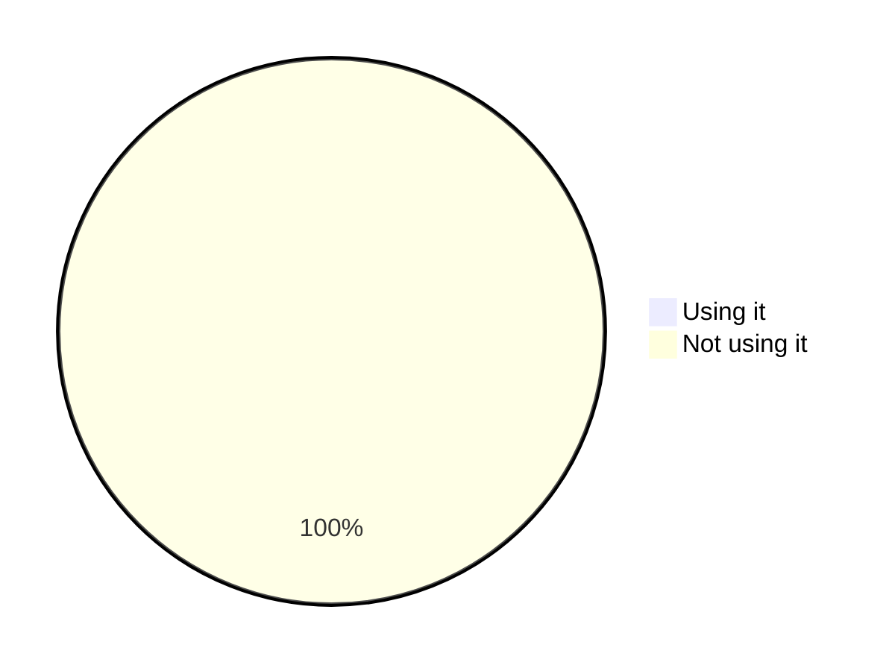
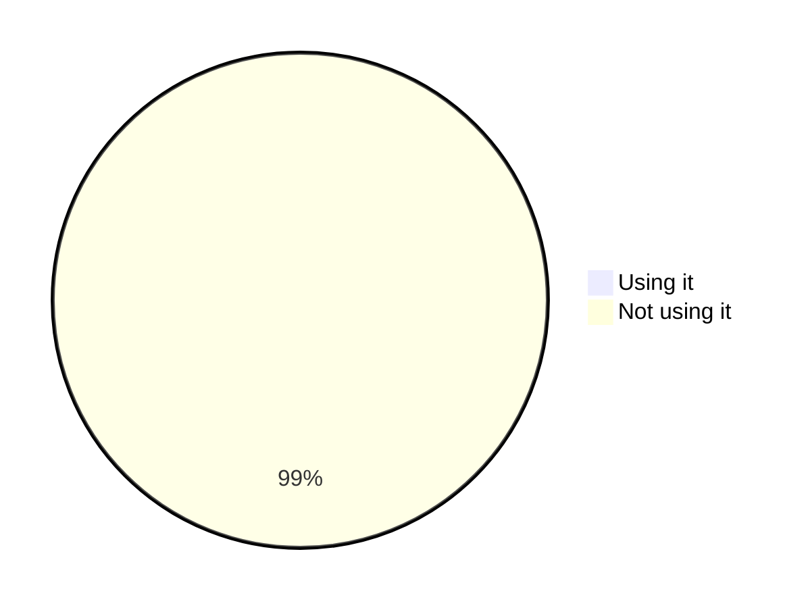
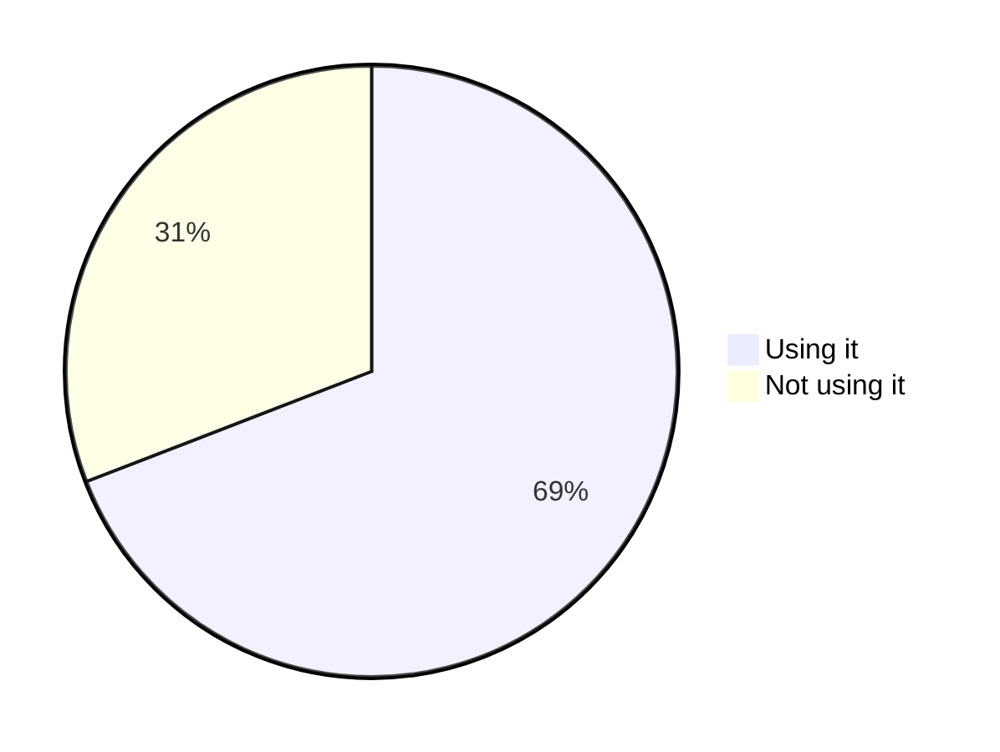
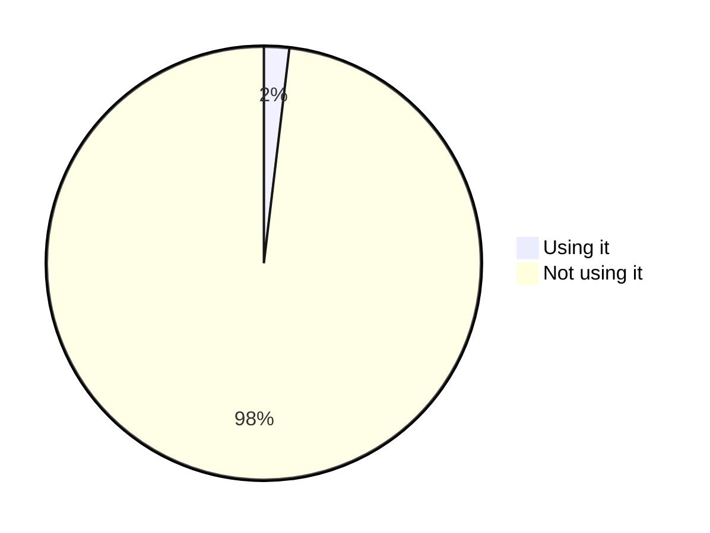
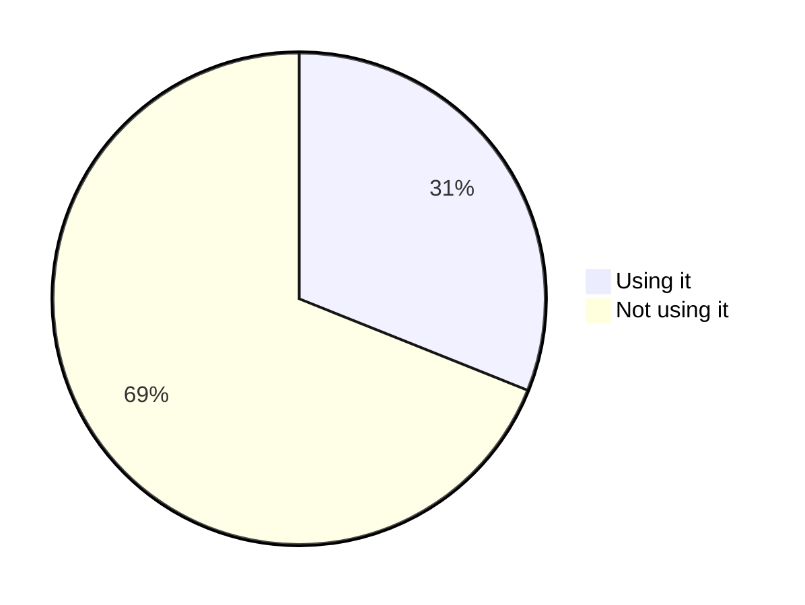
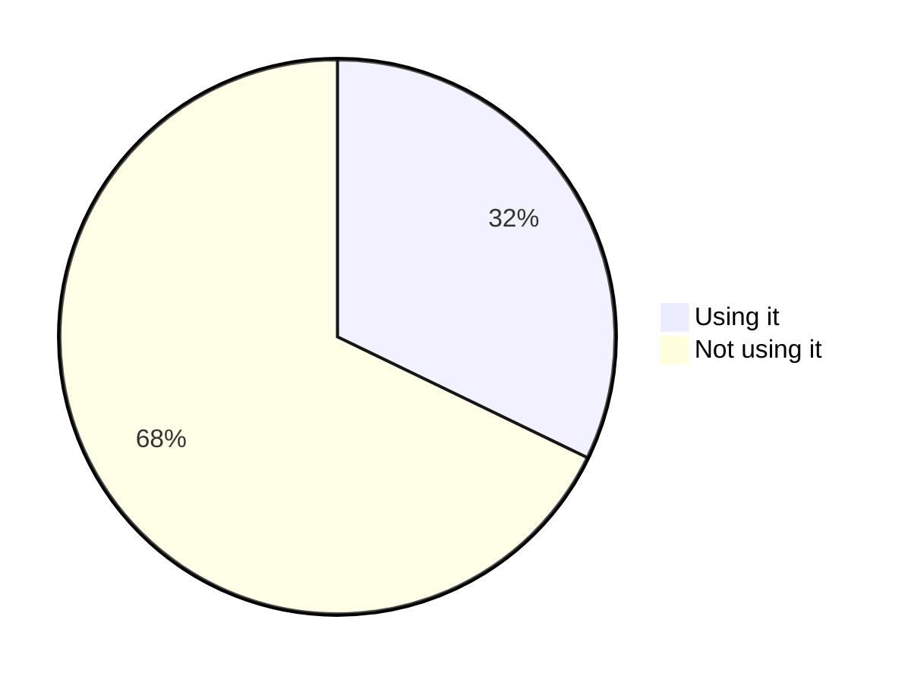

# Statistics
> :timer_clock: Last update: 03/19/2022 at 10:48:10 - Domains analyzed count: 10000.

## Global usage of header 'strict-transport-security'

Provide the distribution of usage of the header 'strict-transport-security' across all domains analyzed.

## Global usage of header 'x-frame-options'

Provide the distribution of usage of the header 'x-frame-options' across all domains analyzed.

## Global usage of header 'x-content-type-options'

Provide the distribution of usage of the header 'x-content-type-options' across all domains analyzed.

## Global usage of header 'content-security-policy'

Provide the distribution of usage of the header 'content-security-policy' across all domains analyzed.

## Global usage of header 'x-permitted-cross-domain-policies'

Provide the distribution of usage of the header 'x-permitted-cross-domain-policies' across all domains analyzed.

## Global usage of header 'referrer-policy'

Provide the distribution of usage of the header 'referrer-policy' across all domains analyzed.

## Global usage of header 'clear-site-data'

Provide the distribution of usage of the header 'clear-site-data' across all domains analyzed.

## Global usage of header 'cross-origin-embedder-policy'

Provide the distribution of usage of the header 'cross-origin-embedder-policy' across all domains analyzed.

## Global usage of header 'cross-origin-opener-policy'

Provide the distribution of usage of the header 'cross-origin-opener-policy' across all domains analyzed.

## Global usage of header 'cross-origin-resource-policy'

Provide the distribution of usage of the header 'cross-origin-resource-policy' across all domains analyzed.

## Global usage of header 'cache-control'

Provide the distribution of usage of the header 'cache-control' across all domains analyzed.

## Global usage of header 'feature-policy'

Provide the distribution of usage of the header 'feature-policy' across all domains analyzed.

## Global usage of header 'permissions-policy'

Provide the distribution of usage of the header 'permissions-policy' across all domains analyzed.

## Global usage of header 'expect-ct'

Provide the distribution of usage of the header 'expect-ct' across all domains analyzed.

## Global usage of header 'public-key-pins'

Provide the distribution of usage of the header 'public-key-pins' across all domains analyzed.

## Global usage of header 'x-xss-protection'

Provide the distribution of usage of the header 'x-xss-protection' across all domains analyzed.

## Global usage of insecure framing configuration via the header 'x-frame-options'

Provide the distribution of usage of the header 'x-frame-options' across all domains analyzed with a insecure framing configuration: value different from DENY or SAMEORIGIN including unsupported values.

## Global usage of the Strict Transport Security 'preload' feature

Provide the distribution of usage of the '[preload](https://developer.mozilla.org/en-US/docs/Web/HTTP/Headers/Strict-Transport-Security#preloading_strict_transport_security)' feature for the header 'strict-transport-security' across all domains analyzed.

