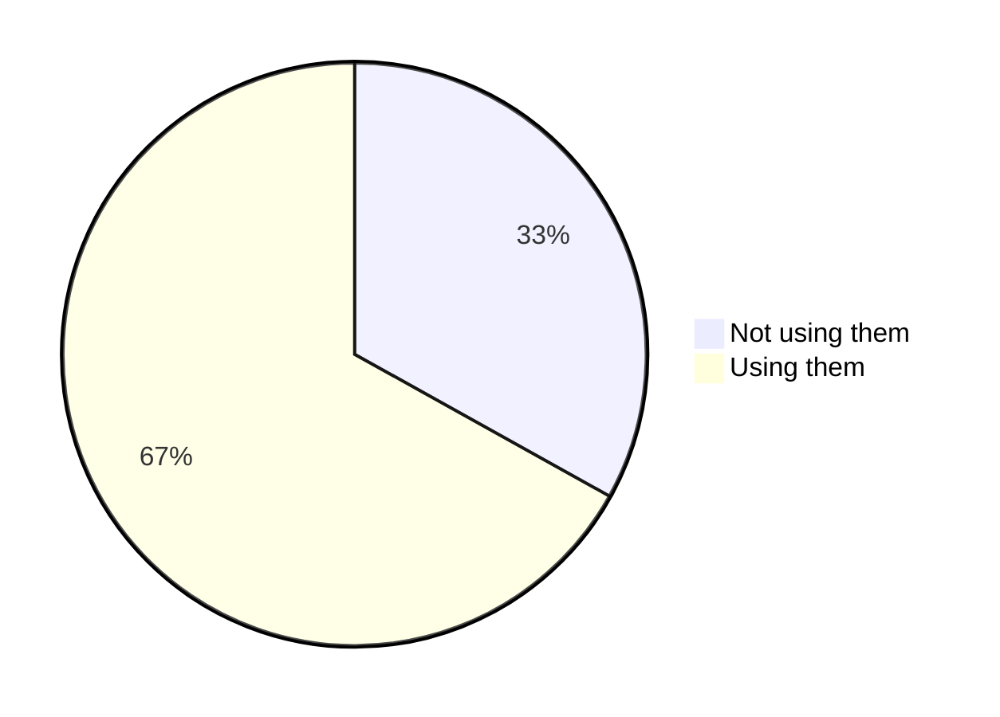
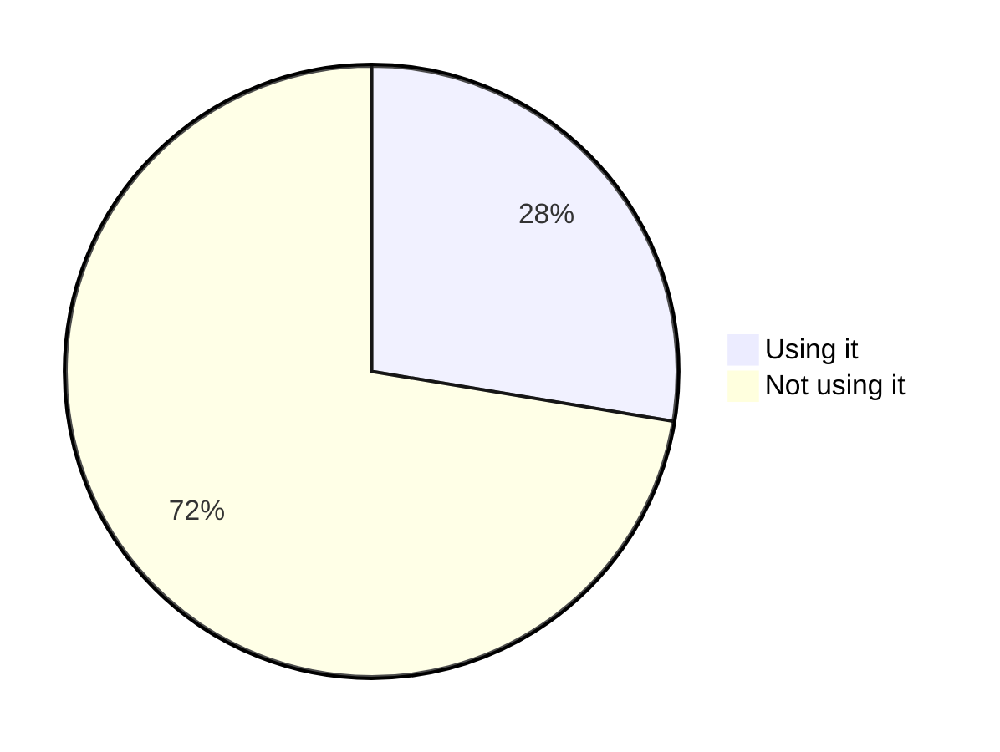

# Statistics
> :timer_clock: Last update: 09/02/2022 at 01:22:00 - Domains analyzed count: 200000.

> :mag_right: View the markdown code to see the exact percentage because mermaid use integer values for rendering.

## Global usage of secure headers

Provide the distribution of usage of secure headers across all domains analyzed.




## Global usage of header 'cache-control'

Provide the distribution of usage of the header 'cache-control' across all domains analyzed.


## Global usage of header 'clear-site-data'

Provide the distribution of usage of the header 'clear-site-data' across all domains analyzed.


## Global usage of header 'content-security-policy'

Provide the distribution of usage of the header 'content-security-policy' across all domains analyzed.


## Global usage of header 'content-security-policy-report-only'

Provide the distribution of usage of the header 'content-security-policy-report-only' across all domains analyzed.


## Global usage of header 'cross-origin-embedder-policy'

Provide the distribution of usage of the header 'cross-origin-embedder-policy' across all domains analyzed.


## Global usage of header 'cross-origin-opener-policy'

Provide the distribution of usage of the header 'cross-origin-opener-policy' across all domains analyzed.


## Global usage of header 'cross-origin-resource-policy'

Provide the distribution of usage of the header 'cross-origin-resource-policy' across all domains analyzed.


## Global usage of header 'expect-ct'

Provide the distribution of usage of the header 'expect-ct' across all domains analyzed.


## Global usage of header 'feature-policy'

Provide the distribution of usage of the header 'feature-policy' across all domains analyzed.


## Global usage of header 'permissions-policy'

Provide the distribution of usage of the header 'permissions-policy' across all domains analyzed.


## Global usage of header 'public-key-pins'

Provide the distribution of usage of the header 'public-key-pins' across all domains analyzed.


## Global usage of header 'referrer-policy'

Provide the distribution of usage of the header 'referrer-policy' across all domains analyzed.


## Global usage of header 'strict-transport-security'

Provide the distribution of usage of the header 'strict-transport-security' across all domains analyzed.




## Global usage of header 'x-content-type-options'

Provide the distribution of usage of the header 'x-content-type-options' across all domains analyzed.


## Global usage of header 'x-frame-options'

Provide the distribution of usage of the header 'x-frame-options' across all domains analyzed.


## Global usage of header 'x-permitted-cross-domain-policies'

Provide the distribution of usage of the header 'x-permitted-cross-domain-policies' across all domains analyzed.


## Global usage of header 'x-xss-protection'

Provide the distribution of usage of the header 'x-xss-protection' across all domains analyzed.


## Global usage of insecure framing configuration via the header 'x-frame-options'

Provide the distribution of usage of the header 'x-frame-options' across all domains analyzed with a insecure framing configuration: value different from `DENY` or `SAMEORIGIN` including unsupported values.


## Global usage of insecure referrer configuration via the header 'referrer-policy'

Provide the distribution of usage of the header 'referrer-policy' across all domains analyzed with a insecure referrer configuration: value set to `unsafe-url` or `no-referrer-when-downgrade`.

`no-referrer-when-downgrade` was included because it send origin, path, and querystring when the protocol security level stays the same (HTTPS is very often in place).


## Global usage of the Strict Transport Security 'preload' feature

Provide the distribution of usage of the '[preload](https://developer.mozilla.org/en-US/docs/Web/HTTP/Headers/Strict-Transport-Security#preloading_strict_transport_security)' feature for the header 'strict-transport-security' across all domains analyzed.

```mermaid
pie
	"Using it" : 20.64
	"Not using it" : 79.36

```


## Global common 'max-age' values of the Strict Transport Security header

* Most common value used is 31536000 seconds (525600 minutes) across all domains analyzed.
* Maximum value used is 1234513412313 seconds (20575223539 minutes) across all domains analyzed.
* Minimum value used is -345032032 seconds (-5750534 minutes) across all domains analyzed.


## Global usage of content security policy with directives allowing unsafe expressions

Provide the distribution of content security policy allowing unsafe expressions across all domains analyzed.

Determine if a CSP policy contains `(default-src|script-src|script-src-elem|script-src-attr|style-src)` directives using `(unsafe-inline|unsafe-hashes|unsafe-eval)` expressions.

Based on [Report-URI CSP](https://report-uri.com/home/generate) generator allowed instructions for CSP directives.

```mermaid
pie
	"Using unsafe" : 4.87
	"Not using unsafe" : 95.13

```

